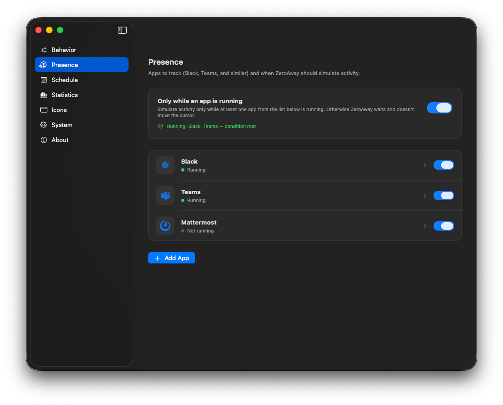

<p align="center">
  
</p>

<h1 align="center">ZeroAway</h1>

<p align="center">
  <strong>Reset system idle. Stay available.</strong><br />
  Native macOS menu bar app — nudge the cursor when idle so presence apps don’t mark you away.
</p>

<p align="center">
  <a href="https://zeroaway.developer.pm/">Documentation</a> ·
  <a href="https://zeroaway.developer.pm/install/">Install</a> ·
  <a href="https://github.com/li-nd/ZeroAway/issues">Issues</a> ·
  <a href="#build">Build</a>
</p>

---


## Features

| | |
|---|---|
| **Sessions** | On/Off from the menu bar · Always (∞) or 1h / 4h / 8h with countdown |
| **Behavior** | Idle timeout · cursor nudge · schedule & presence gates · resume on launch |
| **Presence** | Track Slack, Teams, Mattermost, or any app by Bundle ID |
| **Schedule** | Work days and hours · timed sessions ignore the schedule |
| **Icons** | Role-based presets · online catalog · export / import / contribute via PR |
| **Statistics** | Optional local nudge & session history — nothing leaves this Mac |

## Install

```bash
brew tap li-nd/apps
brew trust li-nd/apps
brew install --cask zeroaway
```

Tap: [li-nd/homebrew-apps](https://github.com/li-nd/homebrew-apps). Or download a zip from [Releases](https://github.com/li-nd/ZeroAway/releases). Full notes: **[Install guide](https://zeroaway.developer.pm/install/)**.

> Builds are **not notarized** (ad-hoc signed). If macOS blocks the app: **System Settings → Privacy & Security → Open Anyway**, or right-click → **Open**.

**Accessibility** is required. Allow ZeroAway under Privacy & Security → Accessibility, then use **Check again** in the app.

## Screenshots

<table>
  <tr>
    <td width="50%"></td>
    <td width="50%"></td>
  </tr>
  <tr>
    <td width="50%"></td>
    <td width="50%"></td>
  </tr>
  <tr>
    <td width="50%"></td>
    <td width="50%"></td>
  </tr>
  <tr>
    <td width="50%"></td>
    <td width="50%"></td>
  </tr>
</table>

## Build

1. Open `ZeroAway.xcodeproj` in Xcode.
2. Select the **ZeroAway** scheme and run (`⌘R`).

## Documentation

Published site: **[zeroaway.developer.pm](https://zeroaway.developer.pm/)**

| Page | Topic |
|------|--------|
| [Install](https://zeroaway.developer.pm/install/) | Homebrew, Releases, build from source |
| [Menu bar](https://zeroaway.developer.pm/menu-bar/) | Sessions and status |
| [Behavior](https://zeroaway.developer.pm/behavior/) | Idle, nudge, gates |
| [Presence](https://zeroaway.developer.pm/presence/) | Tracked apps |
| [Schedule](https://zeroaway.developer.pm/schedule/) | Work hours |
| [Icons](https://zeroaway.developer.pm/icons/) | Catalog, sharing, PRs |
| [Statistics](https://zeroaway.developer.pm/statistics/) | Local history |
| [System](https://zeroaway.developer.pm/system/) | Language, hotkey, access |
| [Troubleshooting](https://zeroaway.developer.pm/troubleshooting/) | Common issues |

### Preview docs locally

```bash
python3 -m venv .venv
source .venv/bin/activate
pip install -r requirements-docs.txt
mkdocs serve
```

Pages deploy from `main` via [`.github/workflows/pages.yml`](.github/workflows/pages.yml) (MkDocs site + presets catalog in one publish).

## License

[MIT](LICENSE) © [Markus Lind](https://github.com/li-nd)
