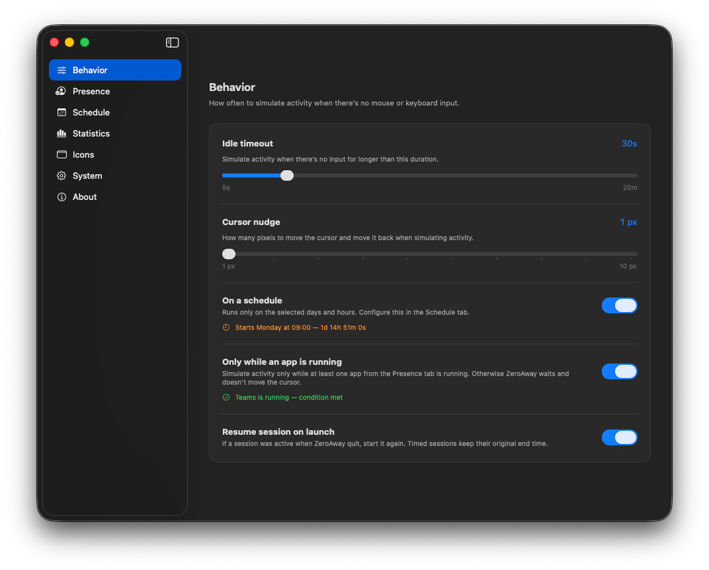

# Behavior

Open **Settings → Behavior** to control when and how ZeroAway simulates activity.

## Idle timeout

After this much time with no mouse or keyboard input, ZeroAway performs a cursor nudge to reset system idle.

- Range: about **5 seconds** to **20 minutes** (slider).  
- Pick a value below your chat app’s away threshold if you want to stay “active” there.

## Cursor nudge

How far (in pixels) the cursor moves and returns when simulating activity. Small values (for example **1 px**) are usually enough and stay discreet.

## On a schedule

When enabled, ZeroAway only nudges during the windows configured under [Schedule](schedule.md). Outside those windows the session can stay on, but status becomes **Waiting** until the next window.

The Behavior card shows the next start (or that the schedule condition is met).

## Only while an app is running

When enabled, ZeroAway nudges only if at least one app from [Presence](presence.md) is running. Otherwise it waits and does not move the cursor.

Live status under the toggle shows which tracked apps are running.

## Resume session on launch

If a session was active when ZeroAway quit, start it again on launch. Timed sessions keep their **original end time** (they don’t restart the full 1h/4h/8h from zero).

## Related

- [Menu bar & sessions](menu-bar.md)  
- [Schedule](schedule.md)  
- [Presence](presence.md)  
