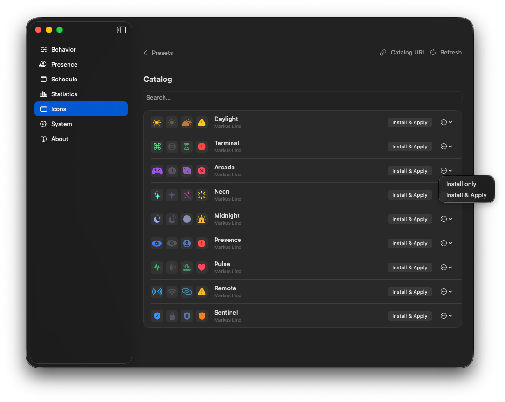

# Icons & presets

Menu bar icons change with ZeroAway’s role: **Active**, **Paused**, **Waiting**, and **Alert**. You can apply built-in sets, install packs from the online **Catalog**, edit your own presets, and share JSON files with other people — or contribute a pack to the public catalog via pull request.

## Built-in presets

Open **Settings → Icons**. Built-in presets (Cursor, Mouse, Office, Signal, Status, …) show a four-role preview. **Apply** activates a set; the current one shows **Active** / **Applied**.


Context menu actions (where available):

- **Edit** / **Duplicate** — open the editor (duplicates create a user copy).  
- **Export…** — save a `.json` file.  
- **Delete** — user presets only.

**Import** loads a JSON file into your library. **Catalog** opens the online store. **Create** starts a new preset from the current styles.

## Catalog

The catalog is a remote JSON index of community (and official) presets.



### Default URL

By default ZeroAway loads:

```text
https://zeroaway.developer.pm/presets-catalog/index.json
```

That file is built from the [`presets/`](https://github.com/li-nd/ZeroAway/tree/main/presets) folder in this repository and published with the documentation site on GitHub Pages.

### Catalog URL & refresh

Use **Catalog URL** to point at another `index.json` (for example a fork or private mirror). **Refresh** reloads the list; the app bypasses local HTTP cache so you see updates after a Pages deploy.

Search matches preset **name** and **author**.

### Install

| Action | Effect |
|--------|--------|
| **Install & Apply** | Copy into your user library and apply immediately |
| **Install only** (⋯ menu) | Copy into the library without changing the current icons |

Installed packs appear under your user presets and can be edited or exported like any other user preset.

## Editor


1. Choose a **role** (Active / Paused / Waiting / Alert).  
2. Set **Name** and optional **Author**.  
3. Pick an SF Symbol from the catalog (only symbols ZeroAway allows will save).  
4. Optionally disable **System color**, pick a color, opacity, and size.  
5. Preview on Light / Dark background, then **Save**.

## Share presets between people

Presets are plain JSON files. Anyone can:

1. **Export…** a preset from Icons.  
2. Send the file (chat, email, gist, AirDrop).  
3. The recipient uses **Import** and then **Apply**.

Tips:

- Keep a unique `id` if you want updates to overwrite the same installed preset; otherwise **Duplicate** after import to avoid clashes.  
- Prefer English `name` values for catalog-style sharing.  
- Symbols must be in ZeroAway’s allowlist or install/apply will fail validation.

## Contribute to the public catalog

You can propose a preset for everyone who uses the default catalog.

### 1. File format

Each preset is one JSON file. Required shape:

```json
{
  "id": "my-preset",
  "author": "Your Name",
  "name": "Display Name",
  "roles": {
    "active": {
      "symbol": "sparkles",
      "systemColor": false,
      "opacity": 1.0,
      "pointSize": 18,
      "color": [0.35, 1.0, 0.88]
    },
    "paused": { "symbol": "sparkle", "systemColor": true, "opacity": 0.4, "pointSize": 18 },
    "waiting": { "symbol": "hourglass", "systemColor": true, "opacity": 0.65, "pointSize": 18 },
    "alert": {
      "symbol": "exclamationmark.triangle.fill",
      "systemColor": false,
      "opacity": 1.0,
      "pointSize": 18,
      "color": [1.0, 0.78, 0.08]
    }
  }
}
```

- `id` — stable slug (filename usually `id.json`).  
- `name` — English display name.  
- `author` — credited in the catalog (for official packs: `Markus Lind`).  
- `roles` — exactly `active`, `paused`, `waiting`, `alert`, each with a `symbol`.

See existing examples under [`presets/`](https://github.com/li-nd/ZeroAway/tree/main/presets) (Daylight, Neon, Terminal, …).

### 2. Open a pull request

1. Fork [li-nd/ZeroAway](https://github.com/li-nd/ZeroAway).  
2. Add your file as `presets/your-id.json`.  
3. Open a pull request describing the theme and roles.  
4. After merge, GitHub Actions rebuilds `presets-catalog/index.json` on Pages.  
5. In the app: **Icons → Catalog → Refresh** to see the new pack.

Maintainers may ask for symbol allowlist fixes or naming tweaks before merge.

## Related

- [System](system.md) — app language (UI strings; preset names stay as authored)  
- [Troubleshooting](troubleshooting.md) — catalog not updating  
