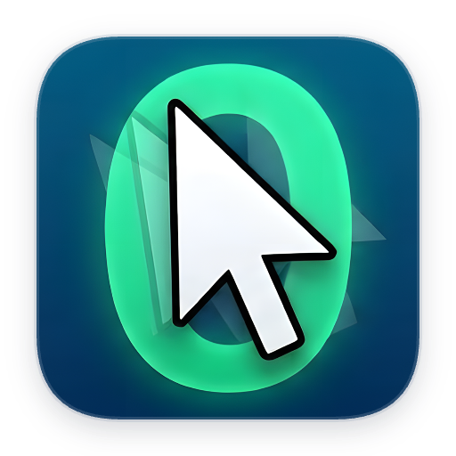
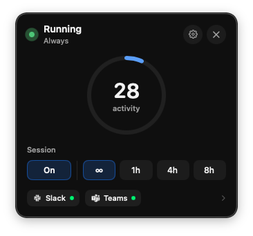

{ width="160" }

# ZeroAway

**Reset system idle. Stay available.**  
A native macOS menu bar app that nudges the cursor when you’re idle so presence apps (Slack, Teams, and similar) don’t mark you away — with schedule, presence gates, icon presets, and local stats.

## Features

| Feature | How it works |
|---------|----------------|
| **[Menu bar & sessions](menu-bar.md)** | Turn a session On/Off from the menu bar. Choose Always (∞) or a timed run (1h / 4h / 8h) with a live countdown. |
| **[Behavior](behavior.md)** | Set idle timeout and cursor nudge size. Optionally require a work schedule and/or a tracked app before nudging. Resume the last session on launch. |
| **[Presence](presence.md)** | Track Slack, Teams, Mattermost, or any Mac app by Bundle ID. When the gate is on, ZeroAway waits until at least one tracked app is running. |
| **[Schedule](schedule.md)** | Limit activity to work days and hours (same hours every day, or per-day ranges). Timed sessions ignore the schedule until the timer ends. |
| **[Icons & presets](icons.md)** | Customize menu bar icons per role (Active, Paused, Waiting, Alert). Use built-in sets, the online catalog, or share JSON presets — including pull requests to the public catalog. |
| **[Statistics](statistics.md)** | Optional local history of nudges and sessions. Charts stay on your Mac; nothing is uploaded. |
| **[System](system.md)** | Language, launch at login, global hotkey, and Accessibility status. |

## Quick start

1. [Install](install.md) with Homebrew (or a Release zip / build from source).
2. Allow **Accessibility** when prompted — required to reset system idle.
3. Open the menu bar popover, turn the session **On**, and pick **∞** or a timed duration.

Then read [Menu bar & sessions](menu-bar.md) for everyday controls.

## Docs

| Page | Topic |
|------|--------|
| [Install](install.md) | Homebrew, Releases, build from source |
| [Menu bar & sessions](menu-bar.md) | Popover, durations, status |
| [Behavior](behavior.md) | Idle, nudge, gates, resume |
| [Presence](presence.md) | Tracked apps and Bundle IDs |
| [Schedule](schedule.md) | Always vs work hours |
| [Icons & presets](icons.md) | Catalog, sharing, contributing |
| [Statistics](statistics.md) | Local usage history |
| [System](system.md) | Language, login, hotkey, access |
| [Troubleshooting](troubleshooting.md) | Common issues |

## License

[MIT](https://github.com/li-nd/ZeroAway/blob/main/LICENSE) © [Markus Lind](https://github.com/li-nd)
