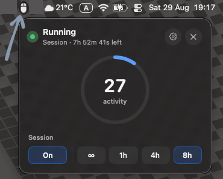
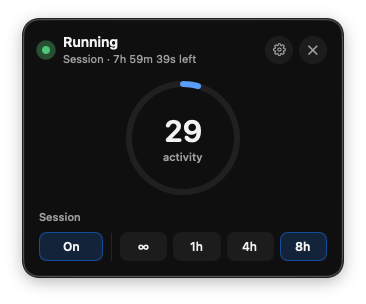
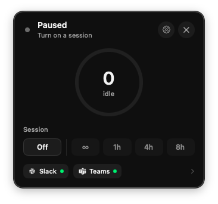
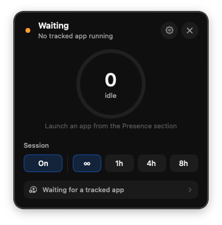

# Menu bar & sessions

ZeroAway lives in the macOS menu bar. Click its status item to open the popover — your main control surface.

## Running (Always)

With Accessibility granted and a session on, the popover shows **Running**, an idle/activity gauge, session chips, and Presence badges when apps are tracked.

- **On / Off** — start or stop the session.  
- **∞** — run until you turn the session off (no timer).  
- **1h / 4h / 8h** — timed session; the header shows remaining time.

## Timed session

Selecting **8h** (or 1h / 4h) starts a countdown. The subtitle shows `Session · … left`. When time runs out, the session ends (and may show a system notification).

!!! note
    Timed **1h / 4h / 8h** sessions **ignore the work schedule** and keep running until the timer ends. See [Schedule](schedule.md).

## Paused

When the session is **Off**, status is **Paused**. The gauge shows idle at zero; turn **On** and pick a duration to resume.

## Waiting

**Waiting** means a session is on, but a gate is blocking nudges — for example **Only while an app is running** and no tracked app is open. The popover explains why and links to Presence settings.

You can also wait because the [schedule](schedule.md) says you’re outside work hours.

## Header actions

- **Gear** — open the settings window.  
- **X** — quit ZeroAway.

## Related

- [Behavior](behavior.md) — idle timeout and gates  
- [Presence](presence.md) — which apps count as “running”  
- [System](system.md) — hotkey to toggle the session  
