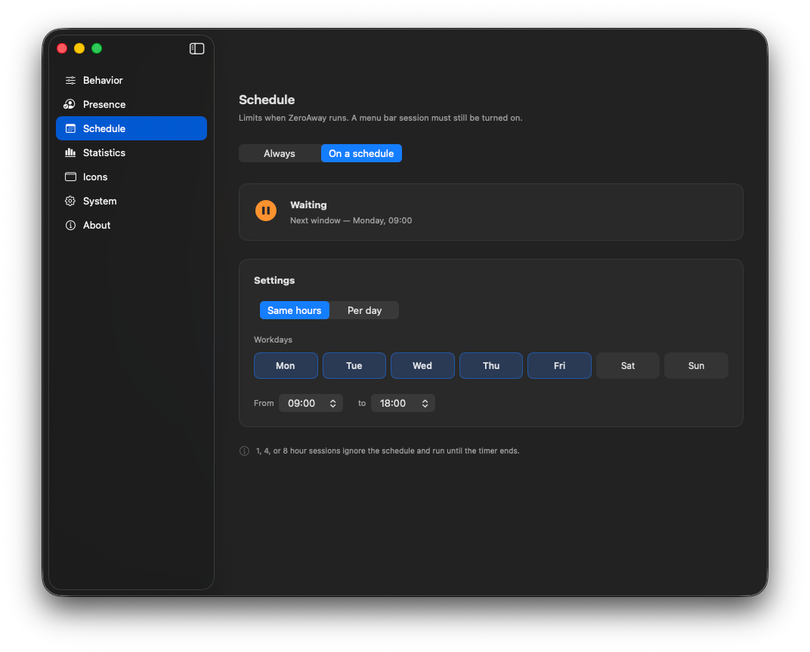
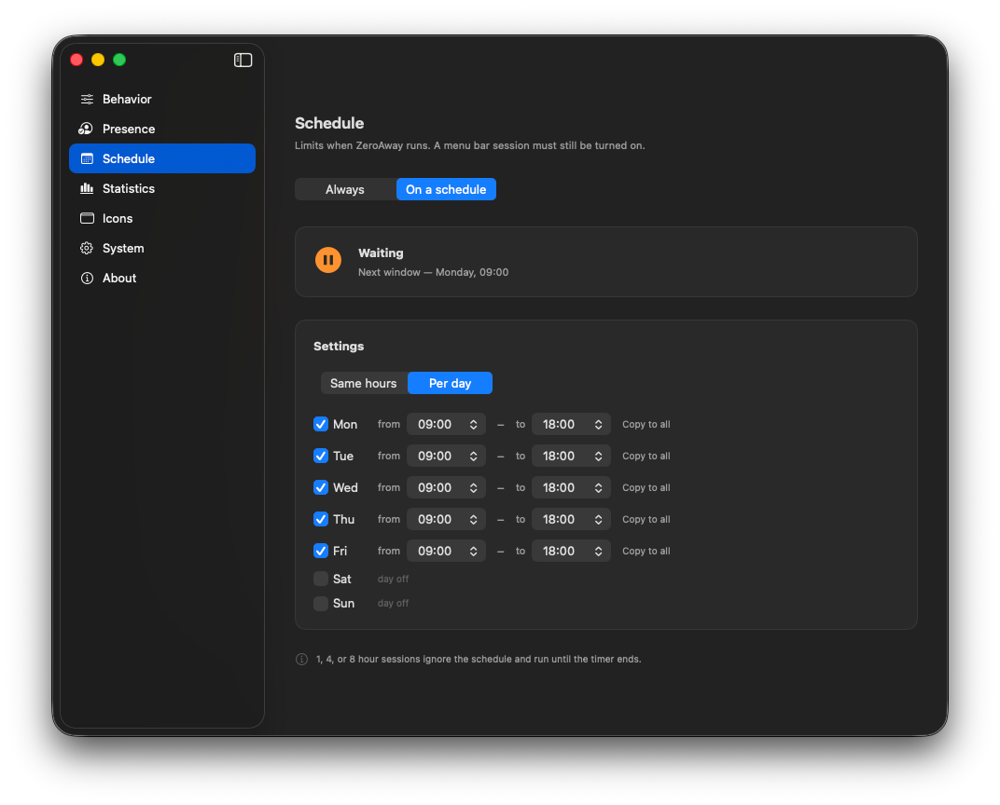

# Schedule

**Settings → Schedule** limits *when* ZeroAway may nudge. A menu bar session must still be **On**.

## Always

No day or hour limits. While a session is on, ZeroAway runs according to Behavior and Presence only.

## On a schedule — same hours

Choose **On a schedule**, then **Same hours**: pick workdays and one shared From/To range (for example Mon–Fri, 09:00–18:00).

Outside the window, status is **Waiting** with the next start time shown.

## On a schedule — per day

**Per day** lets each weekday have its own hours (or day off). Use **Copy to all** to propagate one day’s range.

## Timed sessions vs schedule

!!! important
    Sessions of **1h**, **4h**, or **8h** **ignore the schedule** and run until the timer ends. Only **∞ (Always)** sessions are limited by the schedule when the schedule gate is on.

That note also appears at the bottom of the Schedule panel in the app.

## Related

- [Behavior](behavior.md) — “On a schedule” gate  
- [Menu bar & sessions](menu-bar.md) — timed vs ∞  
