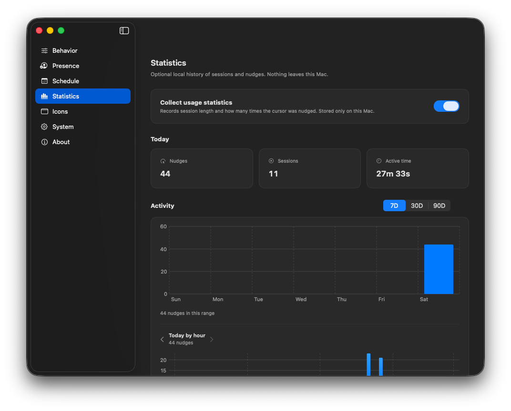

# Statistics

**Settings → Statistics** keeps an optional history of sessions and cursor nudges. Data stays on this Mac only.

## Collect usage statistics

Toggle **Collect usage statistics** to start or stop recording. When off, new events aren’t stored (existing files remain until you clear them).

## Today

Summary cards for the current day:

- **Nudges** — how many times the cursor was moved to reset idle.  
- **Sessions** — how many sessions started.  
- **Active time** — total time sessions were running.

## Activity charts

- Range: **7D / 30D / 90D** bar chart of nudges per day.  
- Click or select a day to drill into **Today by hour** (hourly breakdown).

## History

Below the charts, a table lists past sessions (when, duration, nudges, how the session ended). You can set **retention** (how long to keep records) and **clear** history from this panel.

## Privacy

Nothing is uploaded. Files live under Application Support for ZeroAway on your Mac. See the subtitle in the app: *Nothing leaves this Mac.*

## Related

- [Menu bar & sessions](menu-bar.md) — what a “session” is  
- [Behavior](behavior.md) — when nudges happen  
