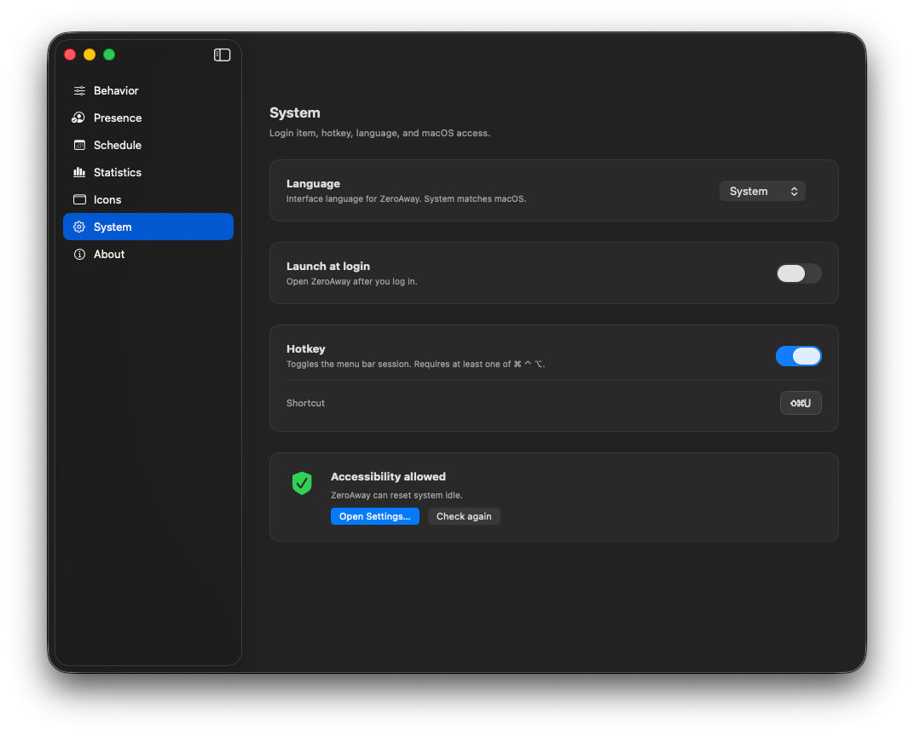

# System

**Settings → System** covers language, login item, hotkey, and macOS Accessibility status.

## Language

Interface language for ZeroAway: **System** (follow macOS), **English**, or **Русский**.

## Launch at login

Open ZeroAway automatically after you log in to your Mac.

## Hotkey

When enabled, a global shortcut toggles the menu bar session. The shortcut must include at least one of **⌘ ⌃ ⌥**. Click the shortcut field and press the new combination to change it.

## Accessibility

Shows whether ZeroAway can reset system idle.

- **Allowed** — green shield; nudges can run (subject to session and gates).  
- **Required** — open System Settings and enable the app, then **Check again**.

The same flow appears in the [menu bar](install.md#accessibility-required) before trust is granted:

## Related

- [Install](install.md)  
- [Troubleshooting](troubleshooting.md)  
