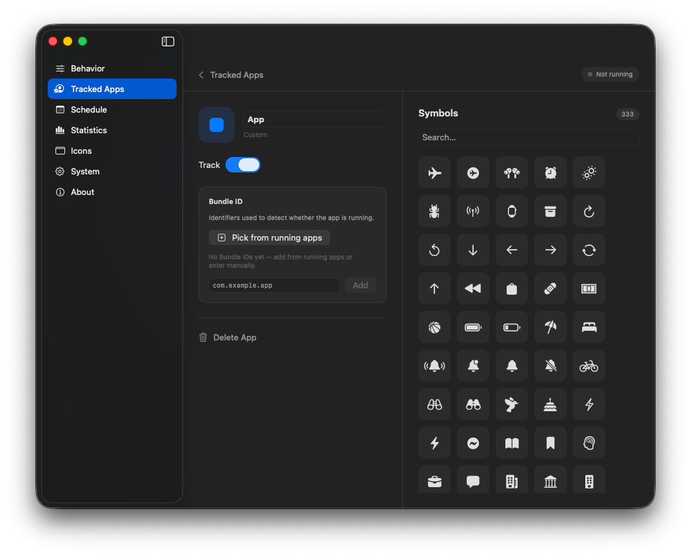
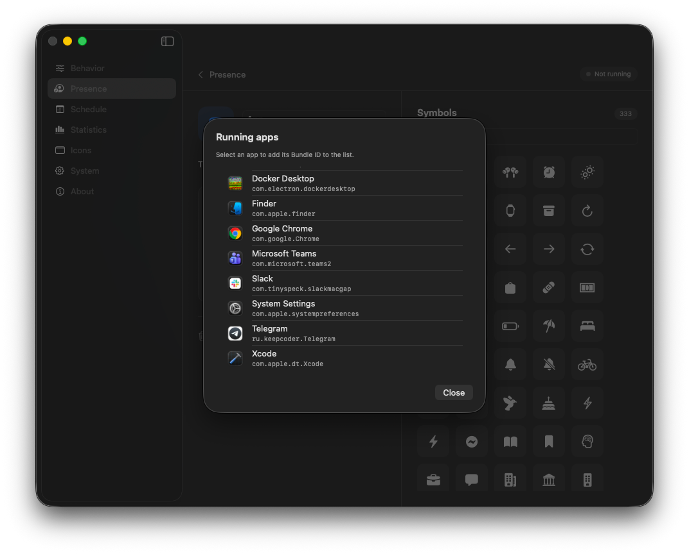

# Tracked Apps

**Tracked Apps** defines which Mac apps ZeroAway watches. Combined with **Only while an app is running** (also on this tab and under Behavior), nudges happen only while at least one tracked app is running — useful so idle isn’t reset when Slack/Teams aren’t open.

## Tracked apps

Built-in entries (Slack, Teams, Mattermost, …) can be toggled on or off. Each row shows whether that app is currently **Running**.

Use **+ Add App** for any other application.

## Add or edit an app

- **Name** and optional icon for badges in the menu bar.  
- **Track** — include this app in the gate.  
- **Bundle ID** — how ZeroAway detects the process.

### Pick Bundle ID from running apps

Use **Pick from running apps** to choose from apps currently open on your Mac:

You can also type a Bundle ID manually (for example `com.tinyspeck.slackmacgap`) and **Add**.

## Menu bar badges

When tracked apps are configured, the popover shows compact badges (active / waiting). The chevron opens Tracked Apps settings.

## Related

- [Behavior](behavior.md) — app-gate toggle and live condition  
- [Menu bar & sessions](menu-bar.md) — Waiting state  
- [Troubleshooting](troubleshooting.md) — stuck on “No tracked app”
