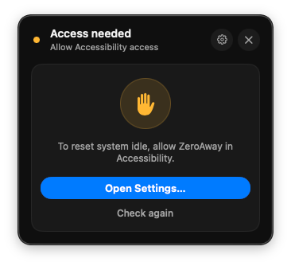
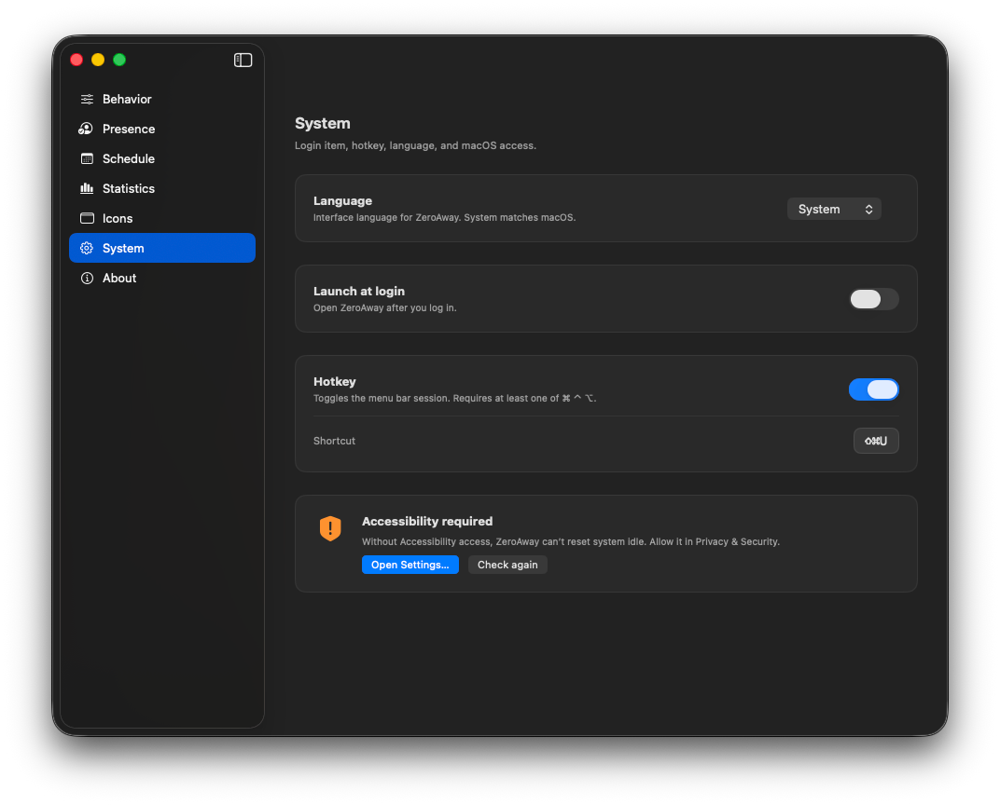

# Troubleshooting

## Idle isn’t resetting / “Access needed”

ZeroAway needs **Accessibility** permission.

1. Use **Open Settings…** from the menu bar gate or **Settings → System**.  
2. Enable **ZeroAway** under Privacy & Security → Accessibility.  
3. Click **Check again**.

If you recently rebuilt the app, macOS may treat it as a new binary — toggle the checkbox off/on or remove and re-add ZeroAway in the list.

See [Install](install.md) and [System](system.md).

## Status stays “Waiting”

**No tracked app running** — Presence gate is on, but Slack/Teams/etc. aren’t open (or aren’t tracked). Open a tracked app or turn off **Only while an app is running**. See [Presence](presence.md).

**Outside schedule** — Schedule mode is on and you’re outside work hours. Wait for the next window, switch Schedule to **Always**, or use a **timed** 1h/4h/8h session (those ignore the schedule). See [Schedule](schedule.md).

## Timed session ignored my schedule

By design: **1h / 4h / 8h** runs until the timer ends. Only **∞** sessions respect the schedule when the schedule gate is enabled.

## Catalog shows old presets

1. In **Icons → Catalog**, click **Refresh** (the app skips local HTTP cache).  
2. Confirm **Catalog URL** is  
   `https://zeroaway.developer.pm/presets-catalog/index.json`  
   (or your intentional custom URL).  
3. GitHub Pages can take a few minutes after a deploy; wait and refresh again.

See [Icons & presets](icons.md).

## Import / Apply preset failed

Symbols must be in ZeroAway’s allowlist. Edit the JSON to use symbols available in the in-app Symbols browser, or install a pack from the official catalog.

## Hotkey doesn’t toggle

Ensure Hotkey is enabled under [System](system.md), the shortcut includes ⌘, ⌃, or ⌥, and another app isn’t capturing the same keys.

## Launch at login doesn’t start ZeroAway

Toggle **Launch at login** off and on again in System settings. Check **System Settings → General → Login Items** for ZeroAway.

## Still stuck?

Open an issue on [GitHub](https://github.com/li-nd/ZeroAway/issues) with your macOS version and what you see in the menu bar status (Running / Waiting / Access needed).
